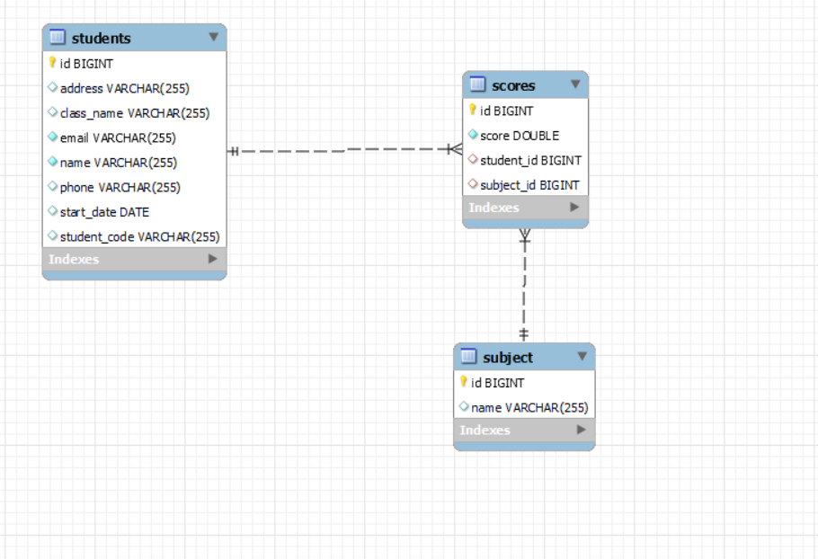

# StudentManagement
# Introduction 
Project mini 
# Technologies Used
Java Spring boot, Spring data Jpa, Mysql
# Install 
1. Run cmd and clone project from github
2. Require: Mysql, Java, JDK and can use IDE IntelliJ IDEA
3. Open project on IDE IntelliJ IDEA 
4. Change information in file application.properties
   - spring.datasource.url: "jdbc:mysql://localhost:3306/student_management", student_management is database 
   - spring.datasource.username: username of mysql
   - spring.datasource.password: password of mysql
- Don't need create table because when running project will auto create table through Entity
- Run project in IDE IntelliJ IDEA and test API in Postman from file Student Management.postman_collection.json
# UseCase
   1. Student
      #### API:
      - Get all student
      - Get student by ID
      - Edit information student
      - Post information student
      - Delete student by ID
      - Get all student in class
   2. Score
       #### API:
      - Post score
      - Update score
      - Get all score by student ID
      - Get all score in subject
      - Get best score in subject (5 students)
      - Get avg score a student

   3. Subject
      #### API
      - Get all subject 
      - Add subject 
      - Edit subject
### In order to understand about api, I have export file JSON from Postman
Student Management.postman_collection.json

4. Database

